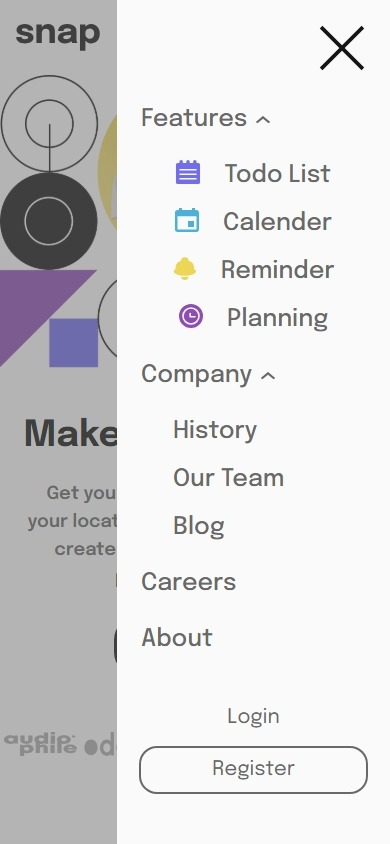

# Table of contents

- [Overview](#overview)
  - [The challenge](#the-challenge)
  - [Screenshot](#screenshot)
  - [Links](#links)
- [My process](#my-process)
  - [Built with](#built-with)
  - [Process](#process)

## Overview

### The challenge

- View the relevant dropdown menus on desktop and mobile when interacting with the navigation links

### Screenshot

- Desktop View

- Mobile View

### Links

- Live Site URL: [https://github.com/akshay-ken/rookie-project-07](https://github.com/akshay-ken/rookie-project-07)

## My process

### Built with

- Semantic HTML5 markup
- clsx
- Flexbox
- Tailwind
- Mobile-first workflow
- [React](https://reactjs.org/) - JS library

### Process

> Problem: want to have hamburger menu on mobile and nav links on desktop.

- **solution**:- i separated both image and nav tag so i can hide one and show one depending on breakpoints.

> having issue with layout like giving grid row and col values it was taking fr unit for height and width so i thought of using custom values like grid-rows-[40vh_40vh] or grid-cols-[50vh_50vh] then realized vh is making empty white space without any reason so i thought of using vw but then realized i can solve this just buy only using grid cols 2.

> i wanted to do conditional rendering if clicked on features or company navbar link so instead on simple useState hook i decide to go with useReducer hook and reducer function also i render div box with absolute positioning and gave it custom shadow for background effect.

> implemented portal for mobile menu and replaced whole popover layout for mobile menu but repeated code due to it to have different nav style on mobile and desktop view i wanted to separate nav with props to make it configurable but it would have been overhead so i decided to go easy on it.
